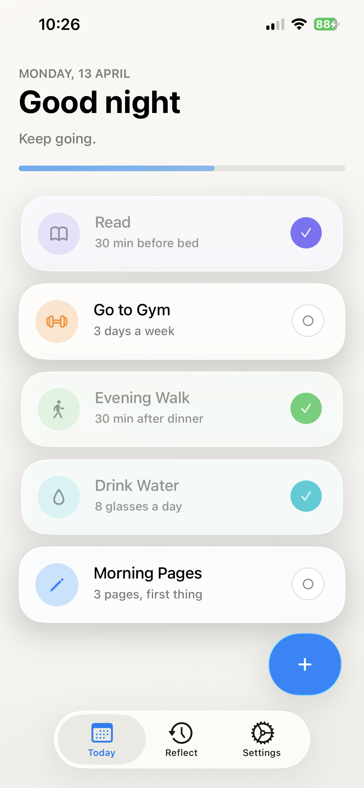
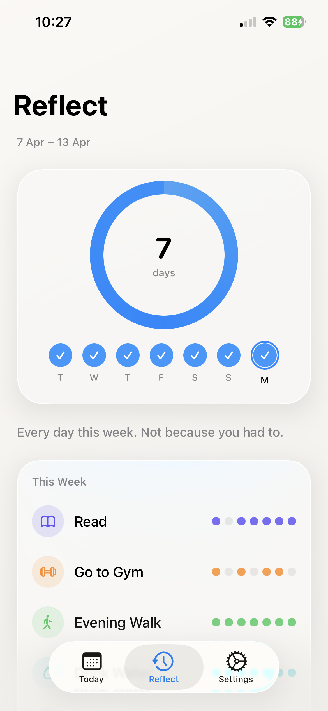
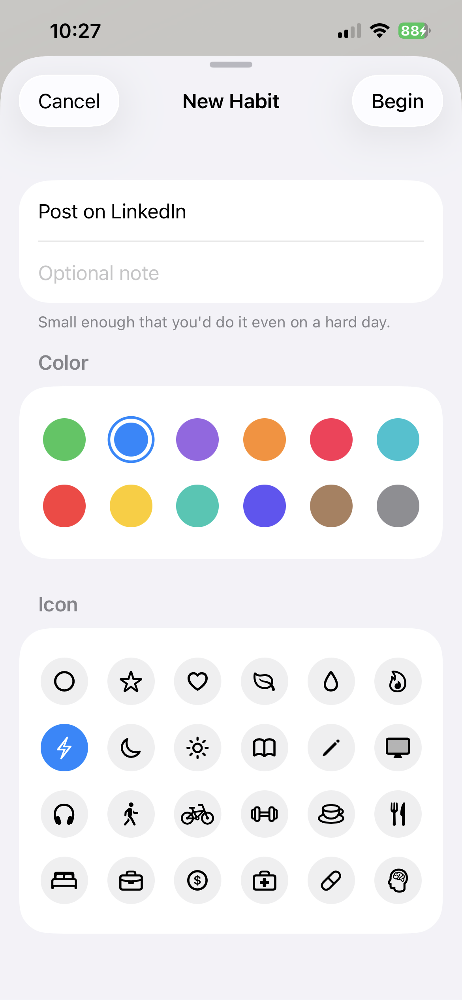
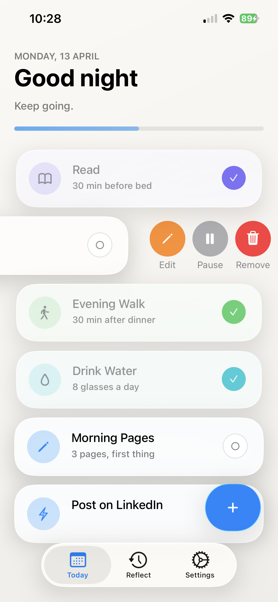

<h1 align="center">Habits</h1>

<p align="center">
  <em>Small steps, every day.</em>
</p>

<p align="center">
  A calm, minimal iOS app for building daily routines — no streaks, no guilt, no internet required.
</p>

<p align="center">
  
  
  
  
</p>

---

## The Problem

Most habit tracking apps get it wrong. They overwhelm users with **streak counters, achievement badges, and complex dashboards** that create a binary success-or-failure mentality. When users inevitably miss a single day, the broken streak produces guilt and anxiety — leading to app abandonment.

> Industry data suggests over **77% of users uninstall habit apps within two weeks.**

Research shows habit formation depends on **consistent, low-friction daily repetition** — not tracking intensity. On average, a behavior takes 66 days to become automatic.

## The Solution — Habits

**Habits** is designed as a response to this problem. It is a quiet daily check-in tool where you:

1. Open the app
2. See today's habits
3. Tap to complete
4. Observe gentle progress
5. Close the app

The entire interaction is designed to take **under 10 seconds**. The experience is closer to a personal daily ritual than a task manager — **rewarding presence, not perfection.**

---

## Screenshots

|  |  |
| :---: | :---: |
| <sub>Today</sub> | <sub>Reflect</sub> |
|  |  |
| <sub>New Habit</sub> | <sub>Swipe Actions</sub> |

---

## Features

| Feature | Description |
| :--- | :--- |
| ✅ **One-tap check-in** | Tap a habit card to toggle it complete — ripple animation and haptic feedback confirm every action |
| 📅 **Today View** | Time-of-day greeting (Good morning / afternoon / evening / night), a gentle progress bar, and your full habit list |
| 📊 **Reflect View** | An animated 7-day ring showing days with any activity, day-letter dots, and a per-habit 7-dot completion row |
| ⏸ **Pause & Resume** | Pause any habit — it moves to a "Paused" section and is excluded from daily progress until resumed |
| 🔔 **Daily Reminder** | One optional notification per day — set a time in Settings; requires notification permission |
| 🎨 **Custom Habits** | Name (up to 40 chars), optional note (up to 120 chars), 12 color choices, and 24 SF Symbol icons |
| 🌗 **Appearance** | System, Light, or Dark mode — set in Settings |
| 📳 **Haptic Feedback** | Distinct haptic patterns per action (completion, delete, reminder toggle); can be disabled in Settings |
| 🔐 **Secure Storage** | `SecureStore` wraps Apple Keychain APIs (`SecItemAdd`, `SecItemCopyMatching`) for secure local data |
| 📵 **Fully Offline** | No accounts, no cloud, no network requests in the default configuration. All data stays on the device |

---

## How to Use the App

### Adding a Habit
1. On the **Today** screen, tap the **+** button in the bottom-right corner.
2. Type a name — keep it short, something you'd do even on a hard day.
3. Optionally add a note (where, when, or why).
4. Pick a **color** and an **icon**.
5. Tap **Begin**. The habit appears in your list immediately.

### Checking In
- **Tap** a habit card to mark it done (or undo it) for today.
- **Swipe right** on a habit card as a quick shortcut to toggle completion.

### Editing, Pausing, or Deleting
- **Swipe left** on a card to reveal three actions: **Edit**, **Pause / Resume**, and **Remove**.
- **Long-press** any card to open the context menu with the same three actions.

### Pausing a Habit
- Swipe left → tap **Pause**. The habit moves to a "Paused" section at the bottom of the list and stops counting toward today's progress.
- Tap the paused card or swipe left → **Resume** to bring it back.

### Reflect Tab
- Tap **Reflect** (the clock icon in the tab bar) to see:
  - A **7-day ring** showing how many days this week had any check-in.
  - **Day-letter dots** (T W T F S S M) with a checkmark for each active day.
  - A **per-habit row** of 7 colored dots showing that habit's completion for the week.

### Reminders
1. Go to **Settings** → **Reminder** → toggle **Daily Reminder** on.
2. A time picker appears — choose when the notification should arrive.
3. Grant notification permission when prompted.
4. If notifications are denied, a **"Open Notification Settings"** button appears to take you directly to iOS Settings.

---

## Built With

| Technology | Role |
| :--- | :--- |
| **Swift 5.0** | Primary programming language |
| **SwiftUI** | All views, layouts, and animations |
| **SwiftData** | Local persistence — `@Model` (`HabitRecord`), `ModelContainer`, `ModelContext` |
| **`@Observable`** | Modern reactive state management via `HabitStore` |
| **LocalAuthentication** | `LAContext` — biometric authentication infrastructure for App Lock |
| **UserNotifications** | `UNUserNotificationCenter` — daily reminder scheduling and permission handling |
| **Security framework** | `SecItemAdd / CopyMatching / Update / Delete` — Keychain storage via `SecureStore` |
| **UIKit** | `UIImpactFeedbackGenerator`, `UINotificationFeedbackGenerator` — haptic engine |
| **StoreKit** | `requestReview` — in-app review prompt in Settings |

---

## Architecture

The app follows **MVVM** (Model–View–ViewModel) with a clean layered architecture:

```
HabitsApp (Entry Point — splash, onboarding, tab navigation)
│
├── Views
│   ├── TodayView          — Habit list, time-based greeting, progress bar, FAB
│   ├── HistoryView        — 7-day ring, day dots, per-habit week rows (labeled "Reflect")
│   ├── SettingsView       — Appearance, haptics, reminders, data stats, about
│   ├── HabitEditorView    — Create / edit sheet (name, note, color grid, icon grid)
│   ├── HabitRowView       — Individual habit card with ripple animation and swipe actions
│   ├── OnboardingView     — First-run staged cascade reveal
│   └── SplashScreenView   — Animated logo on launch
│
├── Store / ViewModel
│   ├── HabitStore         — @Observable source of truth: add, delete, toggle, pause, stats
│   └── HistoryViewModel   — Derived display data (practicedDaysLast7, recentDays) for Reflect
│
├── Data Layer
│   ├── HabitRepository    — SwiftData actor: local cache in HabitRecord, optional remote merge
│   └── PersistenceManager — Legacy JSON store with schema migration and corruption recovery
│
└── Services
    ├── ViewProtectionController — App Lock state machine (LAContext, timeout logic)
    ├── ReminderManager          — UNUserNotificationCenter scheduling and status
    ├── SecureStore              — Generic Keychain read / write / delete wrapper
    └── HapticManager            — Centralised UIFeedbackGenerator with per-event patterns
```

**Key Design Decisions:**

- **Date keys** use `"yyyy-MM-dd"` derived from the device's local calendar — not UTC — eliminating timezone bugs for users who travel across time zones.
- **Completions save on every tap**, not batched, so no data is lost if the app is force-quit.
- **Corruption recovery**: if the JSON file is unreadable, it is renamed to a timestamped backup and the app continues cleanly.
- **Remote sync is optional**: `HabitRepository` supports a `HabitRemoteDataSource` protocol. In the default build, `EmptyHabitRemoteDataSource` is used — no network calls are ever made.

---

## Getting Started

### Prerequisites

> [!IMPORTANT]
> This app targets **iOS 26.4** and uses **Liquid Glass**, a design system introduced in iOS 26. You will need **Xcode 26** and a device or simulator running **iOS 26.4 or later** to build and run this project. It will not compile on earlier versions of Xcode or iOS.

- macOS 15.0 (Sequoia) or later
- Xcode 26.0 or later
- An iPhone or Simulator running **iOS 26.4+**
- No third-party dependencies — pure Apple frameworks only.

### Installation

1. **Clone the repository:**
   ```bash
   git clone https://github.com/sohammayekar/habits.git
   cd habits
   ```

2. **Open in Xcode:**
   ```bash
   open habits.xcodeproj
   ```

3. **Select a target:**
   - Choose a Simulator (e.g. iPhone 16 Pro) or connect your iPhone.

4. **Run:**
   - Press `Cmd + R` or click the Play button.

> **Note:** Features that rely on `LAContext` (biometric App Lock) require a **physical device** — they do not work in the Simulator.

---

## Running the Tests

The project includes a full unit test suite. Run it with `Cmd + U` in Xcode.

| Test File | What it covers |
| :--- | :--- |
| `HabitStoreTests` | Add, delete, toggle, pause, validate (empty name, duplicate, length limits), progress calculation |
| `HabitRepositoryTests` | SwiftData load, save snapshot, remote merge and conflict resolution |
| `PersistenceManagerTests` | JSON encode / decode, legacy schema migration, corruption recovery and backup |
| `ReminderManagerTests` | Notification scheduling, status checks, authorization edge cases |
| `SecureStoreTests` | Keychain save, read, update, delete, and missing-item handling |
| `ViewProtectionControllerTests` | App Lock state machine, timeout logic, bypass and authentication flows |

---

## Roadmap

- [x] Create, edit, delete, and pause habits
- [x] Daily completion toggle with haptic + ripple feedback
- [x] 7-day Reflect view with animated ring and per-habit dots
- [x] Daily reminder notification with permission flow
- [x] Light / Dark / System appearance
- [x] Onboarding and splash screen
- [x] iOS 26 Liquid Glass — FAB, habit cards, buttons, scroll chrome
- [x] App Lock infrastructure (ViewProtectionController + biometric auth)
- [ ] App Lock UI — connect to Settings and app foreground / background lifecycle
- [ ] Home Screen Widget
- [ ] iCloud sync across devices
- [ ] Siri Shortcuts integration

---

## Author

**Soham Mayekar**

- [LinkedIn](https://linkedin.com/in/sohammayekar "Soham Mayekar")
- [GitHub](https://github.com/sohammayekar "sohammayekar")

---

## Support

If you find this project useful, give it a ⭐️ on GitHub — it really helps!

Contributions, issues, and feature requests are welcome. Feel free to open an [issue](https://github.com/sohammayekar/habits/issues "Issues Page").

---

## License

This project is licensed under the **MIT License** — see the [LICENSE](LICENSE) file for details.

---

<p align="center">
  <em>No accounts. No cloud. No pressure. Your data stays on this device.</em>
</p>
